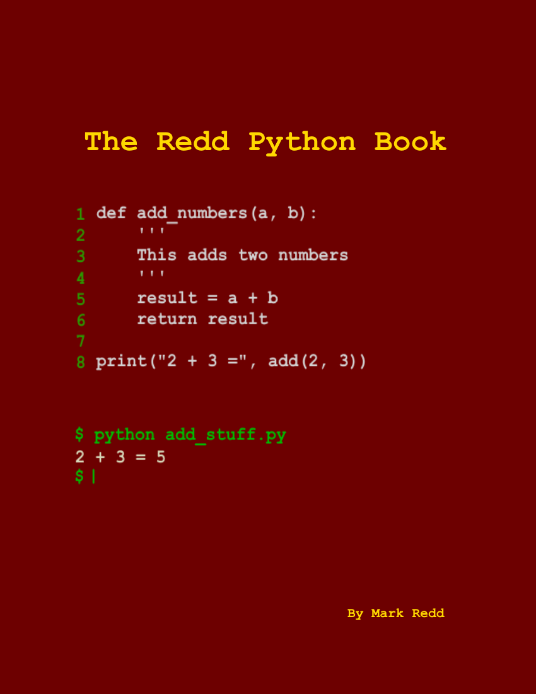

# The Redd Python Book

By Mark Redd

---

The Redd Python Book by <a xmlns:cc="http://creativecommons.org/ns#" href="https://github.com/flythereddflagg/python_book" property="cc:attributionName" rel="cc:attributionURL">Mark Edward Redd</a> is licensed under a <a rel="license" href="http://creativecommons.org/licenses/by/4.0/">Creative Commons Attribution 4.0 International License</a>. All code examples and source code files are licensed under the [MIT License](./LICENSE.txt). 

---

**Project is in pre-alpha**

The Redd Python Book is a book I am writing to make a free resource to learn python for those unfamiliar with programming. As such, if you are already familiar with programming and want to learn python this may not be the best fit for you.

 Eventually, I want to produce PDF and HTML versions of this book but right now markdown is my preferred format for writing.

Input and contributions welcome!

Go to the [Table of Contents](./html/00-Table%20of%20Contents.html) to start reading!

