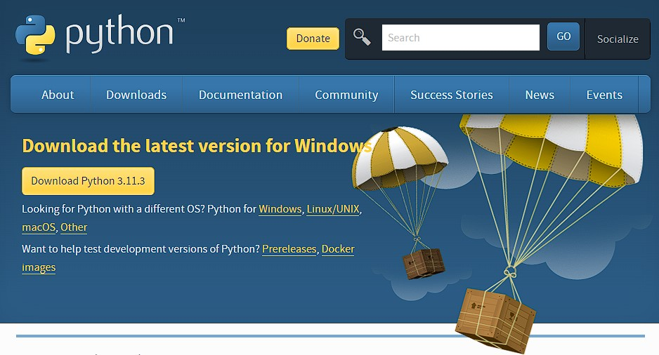
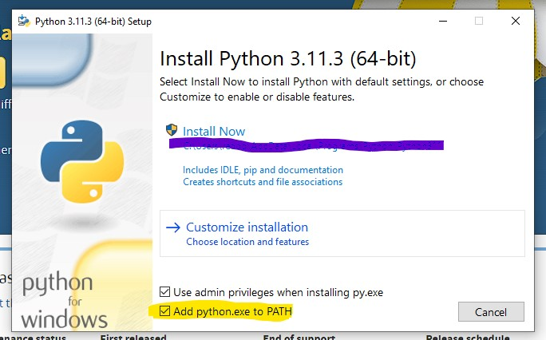

<!-- Navigation -->

---

[Previous: 01-Intro-and-How-to-Use-This-Book](./01-Intro-and-How-to-Use-This-Book.md) | [Table of Contents](./00-Table-of-Contents.md) | [Next: 03-CLI](./03-CLI.md)

---
<!-- End Navigation -->

# 2 - Getting started 

Python is used by many different professionals for different reasons. One of the things that makes Python so useful is it’s versatility. For this reason before you begin, it is useful to think about what you want to get out of Python. I, for example, am a chemical engineer and was introduced to Python in the context of 
engineering and even now I use it to solve engineering problems. However, I also wanted to learn how to make games as a hobby. 

Think about what you want out of Python before continuing. It is possible at 
this point that even after serious thought you just don’t know yet what you want
out of Python. This is just fine for now so don’t worry too much about it. But keep in mind your learning will accelerate in a profound way if you have a goal
in mind or an idea or project you can be passionate about.

### Python the programming language
Python is a programming language. Without being too pedantic, a programming language
is a way to 'talk' to your computer and give it instructions.

Many programming languages are designed for specific tasks such as displaying things on the screen (e.g. HTML, CSS) or doing complex math (e.g. R, MATLAB).
These languages are very useful within their scope of use but they are generally not
functionally complete.

Python on the other hand can be considered a functionally complete programming 
language. All this is to say that Python is designed so that you can write code to do anything a common computer can do. In fact there is very little that
Python cannot do! You can write games, make a web server, do complex math,
make attractive Graphical User Interfaces (GUIs) and many more things. In a very real sense, the only limits are your imagination.

### Python 3 Installation

- **Notes for Linux/Unix and Mac OS X Users:** The following steps should apply to you in the same way they apply to Windows users with a few caveats 
  - If you are an Mac OS X user you can open your terminal by searching your applications using spotlight search (press &#8984;+Space and type in "Terminal" in the search box). 
  - For Linux/Unix users you can usually open your terminal by pressing `ctrl+alt+t`.
  - You may find that Python 3 is already installed on your system. You can check if this is the case by just opening your terminal and typing "Python3". A string of text should appear indicating that Python has started. Also you should see `>>>` at the bottom of the page. If this does not happen then you will need to go through the following steps.

Let's start by going to https://www.Python.org/downloads/ you will see a button there. Ensure that the correct operating system is selected (e.g. Windows, Mac OS X, Linux/Unix). Click on the "Download Python 3.x.x" button to begin the download. 

 

Once downloaded, open the file and you will see the following image. Ensure "Add Python 3.X to PATH" is checked and click "Install Now". Select "Next" on the next few screens and allow it to install on your computer. 

**Note:** If you want to get the 64-bit version or do any custom installation then I'm going to assume you know what you are doing and this tutorial is not necessary for you. If you don't know what any of that means then just do as it says above and you will be fine.

Once the installation finishes, open your terminal or Windows PowerShell and type in `Python` into the prompt and press Enter. You should see something like:

Then type `exit()` and exit the terminal.

If all of this went as described above, congratulations! You have successfully installed Python on your computer!

However if something went wrong, consult the [Trouble Shooting Section](#troubleshooting-your-installation) below.

### Text Editor
The next thing to consider is the way you will write code. True to my coding upbringing, I strongly discourage IDEs and IDLEs. They are not conducive to you learning how to code and will make you dependent on them. I have met too many coders that cannot work on anything but their own IDE and therefore are useless if anything even remotely different comes along.

I am asking for some faith from you right now. But trust me when I say that if you learn to code without an IDE you will learn better than any of your peers that use an IDE.

The question then becomes 'What do I use to code?' I will offer some recommendations but please don't spend too much time agonizing over which text editor to use. They are all largely the same anyway. The only thing that in my mind are must-haves for your text editor are:
 - Syntax Hightlighting
 - Line Numbers

If you can find a text editor that does those two things then you are in business. Feel free to use any editor that can do those two things. (Just don't use and IDE or an IDLE.) Otherwise, here are my recommendations:

 - For Windows users: [Notepad++](https://notepad-plus-plus.org/)
 - For Macintosh users: [Sublime Text](https://www.sublimetext.com/)
 - For Linux users: [Gedit](https://wiki.gnome.org/Apps/Gedit)
 - For any other user looking for possible alternatives (that work on any desktop platform): 
    - [Atom.io](https://atom.io/)
    - [Sublime Text](https://www.sublimetext.com/)
    - [VS Code](https://code.visualstudio.com/)

### CLI
Since one of my goals for you is to teach you on some level how your computer actually works (among other reasons) we will be using the Command Line Interface (CLI) for Windows this means the built-in Windows Power Shell, for Mac OSX and Linux this means the Terminal. Therefore we will spend some time getting to know the terminal before we begin in earnest. 

### System requirements
You may wonder if you computer can handle Python programming. I will simply say that as long as your computer was manufactured after about 2009 you shouldn't worry about anything. That is, with few exceptions, Python should not tax your computer any more than your web browser or office applications do.

I do make some assumptions about your knowledge of computers. If any of the following do not apply to you please familiarize yourself with them before proceeding:

- I can use a web browser to follow links in this book. 
- I am familiar with and know how to perform a search on a search engine like [Google.com](https://www.google.com/).

Once you have determined you are ready, lets begin programming!

### Troubleshooting Your Installation

*|Space Intentionally Left blank|*

<!-- Navigation -->

---

[Previous: 01-Intro-and-How-to-Use-This-Book](./01-Intro-and-How-to-Use-This-Book.md) | [Table of Contents](./00-Table-of-Contents.md) | [Next: 03-CLI](./03-CLI.md)

---
<!-- End Navigation -->
