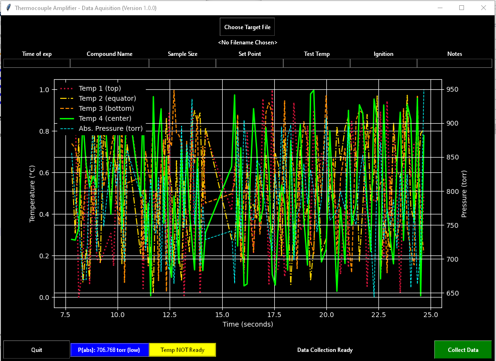

<!-- Navigation -->

---

[Previous: 01 - Intro and How to Use This Book](./01-Intro-and-How-to-Use-This-Book.md) | [Table of Contents](./00-Table-of-Contents.md) | [Next: 03 - CLI ](./03-CLI.md)

---
<!-- End Navigation -->

# 2 - Getting started 

## Okay but what even is Python?

Python is a programming language. Essentially, a programming language is a way to 'talk' to your computer and give it instructions.

Many programming languages are designed for specific tasks such as displaying things in a web browser (e.g. HTML, CSS) or doing complex math (e.g. R, MATLAB). These can be useful but are somewhat limited in the scope of what they are meant to do.

Python on the other hand can be considered an all-purpose, functionally complete programming language. That is, Python is designed for writing code to do almost anything a computer can do. In fact, there is very little that Python cannot do! You can write games, make a web server, do complex math, make Graphical User Interfaces (GUIs) and many more things. In a very real sense, the only limits are your imagination. In this book, we will cover some of these things and how you can take the basics you learn here and apply them to your use case of interest.

## What will I do with Python?

Python is used by many different professionals and amateurs for different reasons. One of the things that makes Python so useful is it’s versatility. For this reason before you begin, it is useful to think about what you want to get out of Python. 

For example, I am a chemical engineer and was introduced to Python in the context of engineering and even now I use it to solve engineering problems. As an example, I needed a way to record temperature and pressure data from a USB-connected device. I could have bought proprietary software but it was expensive, funds were limited and what I needed to do was relatively simple. So I wrote my own software. Here is a screenshot of that software running in 'demo' mode:

I wrote this software in Python and you can too. Or you can write something else that interests you! You want to make games? You want to make a web server? You want to do something else, perhaps something you haven't even thought of yet?

Before anything else, take some time to think about what you want out of Python. It is possible at this point that even after serious thought you just don’t know yet what you want out of Python. If this is the case for you don’t worry too much about it right now but **keep this question in your mind as you learn**. You may find something that interests you. Your learning will accelerate in a profound way if you have a goal in mind or an idea or project you can be passionate about. Also, you will have an opportunity, before finishing this book, to bring an idea to life in code.

## What kind of computer do I need?

You may wonder if you computer can handle Python programming. I will simply say that as long as your computer was manufactured after about 2009 you shouldn't worry about anything. That is, with few exceptions, Python should not tax your computer any more than your web browser or office applications do.

The only real requirement is that you should have at least 2GB of storage space on your computer to allow space for the Python installation, the code you will write, and your text editor. (This is much more than you will actually need but it is best to be conservative.)

## But I know nothing about computers! What do I need to know for this course?

I do make some assumptions about your knowledge of computers. If any of the following do not apply to you please familiarize yourself with them before proceeding:

- I can use a web browser to follow links and navigate the internet in this book. 
- I am familiar with and know how to perform a search on a search engine like [google.com](https://www.google.com/).

## How do I install Python?

*See the notes for Linux/Unix and Mac OS X Users below if you are not using Windows.*

1. Let's start by going to <https://www.python.org/downloads/> you will see a button there. Ensure that the correct operating system is selected (e.g. Windows, Mac OS X, Linux/Unix). Click on the "Download Python 3.x.x" button to begin the download. (See image below.)

   

2. Once downloaded, open the file and you will see the following image. Ensure "Add Python X.X to PATH" is checked (see highlighted in yellow below) and click "Install Now". Select "Next" on the next few screens and allow it to install on your computer. (See image below.)

   

3. Once the installation finishes, open your terminal (for Linux/Unix and Mac OS X users; See the note above.) or Windows PowerShell (press the windows key on your keyboard and type "powershell" then select "Windows PowerShell" or "Terminal" from the list that pops up) and type in `python` into the prompt and press Enter. You should see something like:

   

4. Then type `exit()` and exit the terminal.

If all of this went as described above, congratulations! You have successfully installed Python on your computer!

However if something went wrong, consult the [Trouble Shooting Section](#troubleshooting-your-installation) below.

### Installation Notes for Linux/Unix and Mac OS X Users

The Windows explanation above should apply to you in the same way they apply to Windows users with a few caveats:

- If you are an Mac OS X user you can open your terminal by searching your applications using spotlight search (press &#8984;+Space and type in "terminal" in the search box). 
- For Linux/Unix users you can usually open your terminal by pressing `ctrl+alt+t`. If this does not work I recommend you use a search engine and find out how to do this. (Some Linux/Unix variants have unusual conventions in this regard and I cannot list all the ways to get into your terminal here.) 
- You may find that Python 3 is already installed on your system. You can check if this is the case by just opening your terminal and typing "python3". A string of text should appear indicating that Python has started. Also you should see `>>>` at the bottom of the page. If this does not happen then you will need to go through the steps above.

## What will I use to write Python code?

Good question! You will NOT use something like Word. You will use a text editor. I recommend this one:

- [VSCodium](https://vscodium.com/)

This is the editor I use for the majority of my coding projects. It's free and open source. It gets the job done. If you can't make this text editor work for you or do not like it, here are some alternatives: 

- [Notepad++](https://notepad-plus-plus.org/) (Windows only)
- [Gedit](https://wiki.gnome.org/Apps/Gedit)
- [VSCode](https://code.visualstudio.com/) (this will be almost identical to VSCodium)

Honestly, all you need is an editor that can **syntax highlight for Python** and **display line numbers**. So, please don't spend too much time agonizing over which text editor to use. They are all largely the same anyway.

## Should I use an IDE or IDLE?

Some people may try to encourage you to use and IDE or IDLE. However, true to my coding upbringing, **I strongly discourage IDEs and IDLEs.** They are not conducive to you learning how to code and will make you dependent on them. I have met too many coders that cannot work on anything but their own **IDE** and therefore are useless if anything even remotely different comes along.

I am asking for some faith from you right now. But trust me when I say that if you learn to code without an IDE you will learn better than any of your peers that use an IDE.

## Let's Go!

Once you have determined you are ready, let's begin programming!

## Troubleshooting Your Installation

I will keep a running list of problems with your Python installation and how to solve them. If you get stuck look here. If you cannot find your problem you can write your issue down [here](https://github.com/flythereddflagg/flythereddflagg.github.io/issues) or email me directly (redddogjr@gmail.com).

<!-- - **Sample problem...** Sample Solution...-->

*This space intentionally left blank.*

<!-- Navigation -->

---

[Previous: 01 - Intro and How to Use This Book](./01-Intro-and-How-to-Use-This-Book.md) | [Table of Contents](./00-Table-of-Contents.md) | [Next: 03 - CLI ](./03-CLI.md)

---
<!-- End Navigation -->
