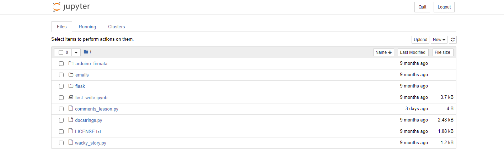
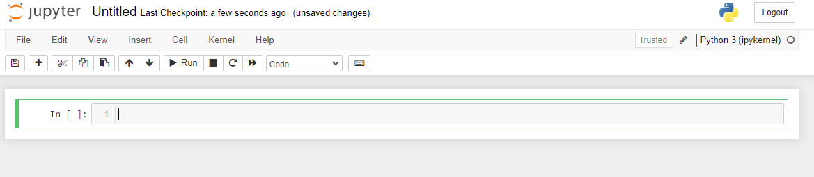
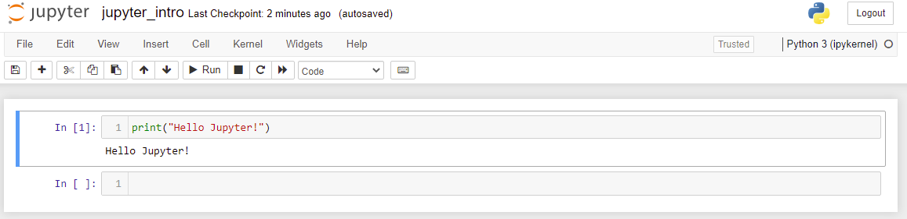

<!-- Navigation -->

---

[Previous: 33 - Branching Out](./33-Branching-Out.md) | [Table of Contents](./00-Table-of-Contents.md) | 

---
<!-- End Navigation -->
# E1 - Getting Started...Again

<!--How much math should they know?-->

The sections of this book that start with an E indicate that this is a tutorial related to science and engineering. In these sections I assume you know a lot more math and more about how to do basic things on your computer (like downloading and installing programs). Plus, if you have gleaned anything from the first 33 sections of the book then you will know that anything you could want to know about your computer or programming is just an internet search away. Here we will cover some common tools you will need to succeed in the Science-Technology-Engineering-Math (STEM) space. WIthout further ado, lets get started!

## Conda

First things first, I am going to have you uninstall Python. 

"What?" you say in disbelief. Don't worry, we will replace it with something better. Or rather, we will replace it with Python but a different distribution of Python called Anaconda.

### What is Anaconda?

Anaconda is a tool for doing scientific programming in a convenient way using Python. Think of it as Python with some (Read: a whole lot of) extra bells and whistles. If you go to the [Anaconda Download Page](https://www.anaconda.com/products/individual) and get it right now you will download Python bundled with hundreds of other libraries used in for various STEM applications. However, **I am going to recommend you do something different**. Instead of downloading half the internet when you only need a few libraries here and there, I recommend you get [Miniconda](https://docs.conda.io/en/latest/miniconda.html#latest-miniconda-installer-links), which is Anaconda without hundreds of bundled packages. Instead of all those you get one extremely useful tool: conda.

### What is conda?

Conda is what `pip` wishes it could be. We have disucssed how ti install more packages with `pip` but it turns out that many times, especially with packages that are used in STEM programming pip will fail to install them correclty or you will run into other issues where one package depends on another but one specific package version that you cannot upgrade until blah blah blah. If you are doing scientific programming you do not want to bother with all that mess. This is where Conda comes in. Conda keeps track of all of this for you and that should be its main pull and you will find everything is much easier once you just start using it so lets go!

## Reinstall Python (but better)

If you are on Windows, go ahead and uninstall Python. If you are on Mac or Linux, check if Python is naitvely installed on your system if it is then DO NOT UNINSTALL! (Unless you want to break your computer. You do you.)

### Install Miniconda on Windows

Now I could just give you the link to [Miniconda](https://docs.conda.io/en/latest/miniconda.html#latest-miniconda-installer-links), and you could just install it (and if that is what you want to do I fully support your decision). However, I tthink that if you want a smoother and cleaner experience you should use a commandline installer like [Scoop](https://scoop.sh). So to get miniconda:

- Follow the [Scoop](https://scoop.sh) link and follow the instructions at the bottom of the page. (Remember that you can use right-click in Powershell to paste copied commands.)
- Once Scoop is installed, install Git with `scoop install git` (scoop uses git to install and update apps)
- Once Git is installed simpy install Miniconda with `scoop install miniconda3`.
- Once the installation finishes you are done! Yay!

The beautiful thing about command line installers is that it is super fast to install anything you want with little to no drama. Granted, there is a learning curve but once you get the hang of it you will wonder why you did it any other way. Given that you should already be familiar with the command line, this should be simple!

### Install miniconda on Mac

*This space intentionally left blank.*

### Install miniconda on Linux

*This space intentionally left blank.*

## Setup Your Main Environment

Lets install the main packages you will need for most scientific computing. Install the following packages with:

```bash
$ conda install numpy scipy matplotlib pandas sympy ipython jupyter
```

### Wait a second, what did I just do?

Using the Conda package manager, you installed 6 packages (and their respective dependencies) that are used all the time in STEM programming. You may find you do not need all of these, but they are the most common and there will be introductory sections on all of them. They are briefly described here:

- `numpy`: [NumPy](https://numpy.org/) (Numerical Python) is a package for doing heavy numerical calculations and especially linear algebra (i.e. matrix math). Compared to normal Python, it is blazing fast and built on powerful mathematical algorithms.
- `scipy`: [SciPy](https://www.scipy.org/index.html) (Scientific Python) is a package for doing scientific computing. This library is also blazing fast and offers access to functions to do numerical calculus (i.e. derivatives, integrals, ordinary differential equations, non-linear equation solving etc.) as well as other math used in many science and engineering disciplines.
- `matplotlib`: [MatPlotLib](https://matplotlib.org/stable/index.html) (MATLAB Plotting Library) is a package that lets you produce graphs and figures and includes an interface that is modeled after MATLAB's graphing functionality. This makes it easy to use and quick for producing professional-grade graphs.
- `pandas` [Pandas](https://pandas.pydata.org/) is a data analysis package for Python that allows a convenient way to work with data from text files, Microsoft Excel files, SQL databases, and many other sources. Highly useful and powerful, the package allows easy access to their powerful DataFrame class for easy organization of data.
- `sympy`: [SymPy](https://www.sympy.org/en/index.html) (Symbolic Python) is a package for doing symbolic math including algebra and calculus. It allows displaying math in a convenient way and offers other helpful tools in the symbolic math space.
- `ipython`: [IPython](https://ipython.org/) (Interactive Python) provides an improved experience with the Python interpreter. It allows expanded functionality and convenience features for programming not provided by the built-in interpreter.
- `jupyter`: [Jupyter](https://jupyter.org/) provides a convenient interface for running code one chunk at a time and organizing code in a presentable way. The tool is language agnostic and is available for several other languages besides Python.

All of these tools are tightly integrated and rely on one another to various degrees. They are all commonly used with IPython and Jupyter to display and work with them. We will begin by using Jupyter to get started!

## Open a Jupyter Notebook

**NOTE:** In this book, we will only use Jupyter Notebooks but there is a more advanced interface called Jupyter Lab. If you wish you may use it instead but there will not be a tutorial on it (unless I change my mind for some reason).

Open a terminal window and navigate to where you want to store the exercises for this section. Then, having installed all these packages, open jupyter-notebook with:

```bash
$ jupyter-notebook
# OR
$ jupyter notebook
```

This should start a small and local webserver that should open a webpage that should look like:


On this page there should be a table with all the files in that folder. Use the `new` dropdown menu (in the top-right corner of the file table) and select `Python 3`. This will open a new Jupyter notebook that should look like:



Here you can run code just like in a normal python script. Start by renaming the notebook by clicking on "Untitled" at the top of the screen. Then write and run the following code:

```python
print("Hello Jupyter!")
```

You can run the code by using the "Run" button or pressing `Shift+Enter` on your keyboard to get:



Now that you have done the basics. Use the interface tour to familiarize yourself with the Jupyter environment (Help->User Interface Tour).

## Hone Your Skills

- Use the internet to look up "ipython magic commands". What are they and how do they work? Use them in a Jupyter notebook to  run command line arguments and use the help fuction.
- Look up how to use Markdown in Jupyter. Use the internet to look up Markdown syntax and write some documentation in your notebook.
<!-- Navigation -->

---

[Previous: 33 - Branching Out](./33-Branching-Out.md) | [Table of Contents](./00-Table-of-Contents.md) | 

---
<!-- End Navigation -->
