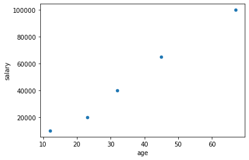

<!-- Navigation -->

---

[Previous: E01 - Getting Started Again](./E01-Getting-Started-Again.md) | [Table of Contents](./00-Table-of-Contents.md) | [Next: E03 - Numpy ](./E03-Numpy.md)

---
<!-- End Navigation -->

# E2 - Pandas

It's time to learn the basics of Pandas! Pandas is a powerful tool for data analysis and manipulation. The power of Pandas is centered around two classes: the Series class and the DataFrame class.

## A Basic Series

Lets try using the Series class. The following exercise will get your feet wet (I recommend you do these exercises in a Jupyter notebook).

```python
# In Jupyter:
# In[1]:
import pandas as pd
# In[2]:
input_data = [3,2,5.0,36,23.342,34,53.3]
the_series = pd.Series(data=input_data)
the_series
# Out[2]:
"""
0     3.000
1     2.000
2     5.000
3    36.000
4    23.342
5    34.000
6    53.300
dtype: float64
"""
```

As you can see, the Series is a lot like a list. But it is also like a dictionary. In the output, there is a column of index values that act as keys that map to the various values. Therefore, using one of the Series' methods for sorting you get the following:

```python
# In[3]:
the_series.sort_values()
# Out[3]:
"""
1     2.000
0     3.000
2     5.000
4    23.342
5    34.000
3    36.000
6    53.300
dtype: float64
"""
```

Notice how the values are now in order but the index-value paring is preserved (i.e. now the index column is out of order). In fact, we can make a series that has an arbitrary index as follows:

```python
# In[4]:
another_series = pd.Series(
    data=input_data, 
    index=[
        'n cheeses', 
        "spam", 
        32, 
        "the number 36", 
        "ohh a real float!", 
        22.2, 
        "the last num"
    ]
)
another_series
# Out[4]:
"""
n cheeses             3.000
spam                  2.000
32                    5.000
the number 36        36.000
ohh a real float!    23.342
22.2                 34.000
the last num         53.300
dtype: float64
"""
```

The only other thing you need to know right now is that the data type of the values in the Series is displayed in the printed part and may be one of a few types. The types are explained briefly [here](https://pandas.pydata.org/docs/reference/api/pandas.DataFrame.dtypes.html).

**Your Assignment:** Read about Series in the [Pandas Documentation](https://pandas.pydata.org/docs/reference/api/pandas.Series.html). You do not have to understand every method in the class but do understand all off the examples on that page.

## A Basic DataFrame

A DataFrame you may think of as a dictionary of Series objects. Another way to think of a DataFrame is a table with column and row headings. The following example will show how this works.

```python
# In[1]:
import pandas as pd

# In[2]:
some_data = {
    "name": ["Jared", "Lisa", "Jan", "Peter", "Ben"],
    "sex": ['M', 'F', 'F', 'M', 'M'],
    "age": [23, 32, 45, 12, 67],
    "salary": [20e3, 40e3, 65e3, 10e3, 100e3]
} # notice that all of the values must be iterables of the same length

# In[3]:
df = pd.DataFrame(some_data)
df # if you are not using Jupyter use print here instead
# Out[3]:
"""
    name sex  age    salary
0  Jared   M   23   20000.0
1   Lisa   F   32   40000.0
2    Jan   F   45   65000.0
3  Peter   M   12   10000.0
4    Ben   M   67  100000.0
"""

# In[4]:
# This is an example of filtering using Pandas indexing functionality
# If you are not using Jupyter use print instead of display
display(df[df['sex'] == 'M']) 
display(df[df['salary'] > 30e3])
# Out[4]:
"""
    name sex  age    salary
0  Jared   M   23   20000.0
3  Peter   M   12   10000.0
4    Ben   M   67  100000.0
   name sex  age    salary
1  Lisa   F   32   40000.0
2   Jan   F   45   65000.0
4   Ben   M   67  100000.0
"""

# In[5]:
# DataFrames are like dictionaries
# Keys are column names and values are Series objects
df['age'].mean()
# Out[5]:
"""
35.8
"""
```

As you can tell from the example. A DataFrame object is a way of dealing with a table of data and is like a dictionary with column names as the keys and Series objects as the values. On top of dictionary-like functionality, there are lots of different powerful methods available in the objects. A complete reference is available on the [Pandas documentation website](https://pandas.pydata.org/pandas-docs/stable/reference/api/pandas.DataFrame.html). I have provided a brief introduction to DataFrames here but they are immensely powerful and useful.

**Your Assignment:** Like the Series class, read through the documentation on the Pandas website for DataFrames. Again, you do not need to understand everything but make sure you understand the examples and attributes. Then look at some of the functionality built in to DataFrames. If you are familiar with spreadsheet software like Microsoft Excel, you will notice a lot of the functionality of Excel is implemented here.

## Loading Data

Now you could just manually write everything to a dictionary to load a DataFrame but that is not what we're about here. We would like it if we could work with data directly from its source. So, I have multiple ways of loading the data into a DataFrame to be used.

### CSV and Excel Files

If you don't already know, CSV stands for "Comma-Separated Values" and is a common way of storing data in text format. Each comma separates a column of data (although there are various characters commonly used for "delimiting" columns), each row is separated by a newline character, and the files will have the extension ".csv". Otherwise, CSV files are perfectly normal text files. Here is what our file data looks like in CSV format:

```txt
name,sex,age,salary
Jared,M,23,20000.0
Lisa,F,32,40000.0
Jan,F,45,65000.0
Peter,M,12,10000.0
Ben,M,67,100000.0
```

You can download this CSV file [here](./media/e_sections/some_data.xlsx). We can then load it into a DataFrame with two lines of code:

```python
import pandas as pd

df = pd.read_csv("./some_data.csv")
```

The same can be done with an [Excel File](./media/e_sections/some_data.xlsx).

```python
import pandas as pd

df = pd.read_excel("./some_data.xlsx")
```

**Your Assignment:** Play around with this functionality. Can you write a new file (i.e. a new CSV or Excel file) from your DataFrame? How do you skip some rows in your file when loading it? Can you select which columns and rows get loaded into your DataFrame? Search the internet and try to figure this out.

### SQL

Data may also be read from a SQL database. In this example we will use SQLite (the database is [here](./media/e_sections/some_data.db)), but there are many other types of SQL databases.

```python
import pandas as pd

with sql.connect("./some_data.db") as con:
    df = pd.read_sql("select * from some_data", con)
```

Notice, you can use the `pd.read_sql` function to run a SQL query on the database (this database has one table called "some_data"). But you can simplify this process using functionality from another Python package called `sqlalchemy`.

**Your Assignment:** Can you write a new table or SQL database using Python? Look into `sqlalchemy` to find out how to more efficiently use SQL in database management. 

## Plotting Data

Pandas can also plot data using `matplotlib`. There is no need to import `matplotlib`, but it must be installed for the following example to work.

```python
import pandas as pd
# import matplotlib.pyplot as plt # uncomment if not using Jupyter Notebook

df = pd.read_csv("./e_sections/some_data.csv")
df.plot('age', 'salary', 'scatter')

# plt.show() # uncomment if not using Jupyter Notebook
```



In a Jupyter Notebook, the plot will render in the notebook output. If you use Python without a Jupyter Notebook, it will render in a separate window. If you look at the [documentation](https://pandas.pydata.org/pandas-docs/stable/reference/api/pandas.DataFrame.plot.html) you can learn more.

**Your Assignment:** Read the documentation linked above. See the different ways you can plot data. In a later section we will explore `matplotlib` in more detail.

## Hone Your Skills

I assume if you are reading this section that you already work with some kind of data. Hopefully this section will help you get started using Pandas to work with data more efficiently. These exercises are aimed at you.

- Use the tools presented in this section to perform statistical calculations on your data. Can you calculate confidence intervals and do other interesting things with your data?
- Plot your data and use different kinds of plots (See the [documentation](https://pandas.pydata.org/pandas-docs/stable/reference/api/pandas.DataFrame.plot.html)).
- Explore the ways you can parse and load data using the different methods. What if you need to skip some rows in the excel file? How can you get data from multiple tables out of a SQL database?
- Look up [`sqlalchemy`](https://www.sqlalchemy.org/). If needed download the package using `conda` or `pip`. Find out how you can access a database you may be using.
- Read the [User Guide](https://pandas.pydata.org/docs/user_guide/index.html) to Pandas and, in particular, focus on the section called "10 Minutes to Pandas".

<!-- Navigation -->

---

[Previous: E01 - Getting Started Again](./E01-Getting-Started-Again.md) | [Table of Contents](./00-Table-of-Contents.md) | [Next: E03 - Numpy ](./E03-Numpy.md)

---
<!-- End Navigation -->
